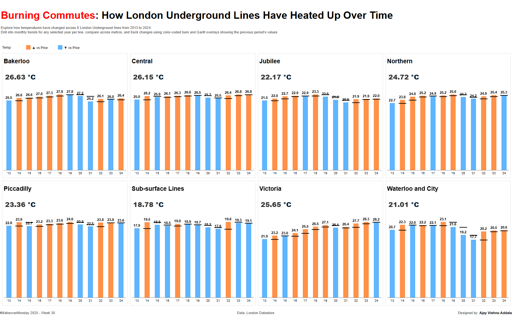

# 🚇 London Underground Summer Temperatures (2013–2024)

  
*A snapshot of the interactive Tableau dashboard*

## 📊 Overview

This interactive Tableau dashboard visualizes **summer temperatures (July–August)** recorded across **8 London Underground lines** from **2013 to 2024** using Transport for London data.

Users can:
- Compare **average yearly temperatures** across different lines
- **Drill down** into **monthly trends** for any selected year per metro line
- **Independently select years** for each line (e.g., 2014 for Bakerloo, 2016 for Central)
- Use **color-coded bars** to see temperature increases or decreases from the previous period
- View **Gantt overlays** indicating prior year/month values
- Click to toggle between **yearly and monthly views**

## 📍 Key Features
- 8 separate bar charts (one for each line)
- Dynamic parameters to allow independent year selection
- Click-based drilldown and return navigation
- Color-coded comparisons (higher/lower than previous period)
- Clean, minimal layout with interactive highlights

## 🔗 View the Dashboard

👉 [**View on Tableau Public**](hhttps://public.tableau.com/views/LondonUndergroundTemperaturesMOM2025W30/LondonTemps?:language=en-US&:sid=&:redirect=auth&:display_count=n&:origin=viz_share_link)

